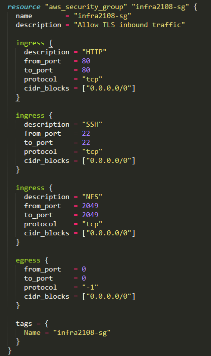

# Terraform-AWS-2
Terraform is an open-source tool created by **HashiCorp**. It is used for building, changing, and versioning infrastructure safely and efficiently. Terraform can manage existing and popular service providers as well as custom in-house solutions.  

#### Statement:
* Create Security group which allow the port 80.
* Launch EC2 instance.
* In this Ec2 instance use the existing key or provided key and security group which we have created in step 1.
* Launch one Volume using the EFS service and attach it in your vpc, then mount that volume into /var/www/html
* Developer have uploded the code into github repo also the repo has some images.
* Copy the github repo code into /var/www/html
* Create S3 bucket, and copy/deploy the images from github repo into the s3 bucket and change the permission to public readable.
* Create a Cloudfront using s3 bucket(which contains images) and use the Cloudfront URL to  update in code in /var/www/html

Here I have created a infrastructure in **HCL (Hashicorp Configuration Language)** which consists of 
 
* Create a Key to log in to the EC2 instance or to connect to it via SSH to run commands.

* Create a security group for the instance, and provide inbound and outbound rules.

* Create an AWS instance, using Amazon Linux 2 AMI (HVM)

*  Launch one Volume using the EFS service and attach EFS to VPC and Instance.

* Mount the EFS to /var/www/html directory so that all the files are permanently stored in EFS.

* Create an S3 bucket. Setting permissions to Public so that it's publically accessible.

* Create a CDN using AWS CloudFront for S3 Bucket. Setup the cache precedence. Put restrictions based on the requirements. And add the cloud-front URL in the WebPage.

* Launch the webpage on the CHROME using Instance Public_IP.

### For reference 
[`Infrastructure.tf`](https://github.com/Sparsh-Agrawal/Terraform-AWS-2/blob/master/infra.tf)

[`LinkedIn`](https://www.linkedin.com/pulse/aws-infrastructure-using-terraform-ii-sparsh-agrawal/?trackingId=SlFNR9nMSiuxdx5QzyoFcQ%3D%3D)
