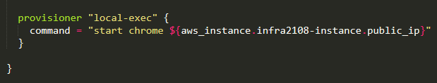

# Terraform-AWS-2
Terraform is an open-source tool created by **HashiCorp**. It is used for building, changing, and versioning infrastructure safely and efficiently. Terraform can manage existing and popular service providers as well as custom in-house solutions.   
Here I have created a infrastructure in **HCL (Hashicorp Configuration Language)** which consists of 
 
* Create a Key to log in to the EC2 instance or to connect to it via SSH to run commands.

* Create a security group for the instance, and provide inbound and outbound rules.

* Create an AWS instance, using Amazon Linux 2 AMI (HVM)

*  Launch one Volume using the EFS service and attach EFS to VPC and Instance.

* Mount the EFS to /var/www/html directory so that all the files are permanently stored in EFS.

* Create an S3 bucket. Setting permissions to Public so that it's publically accessible.

* Create a CDN using AWS CloudFront for S3 Bucket. Setup the cache precedence. Put restrictions based on the requirements. And add the cloud-front URL in the WebPage.

* Launch the webpage on the CHROME using Instance Public_IP.

